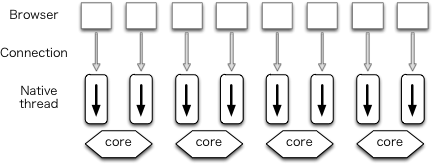
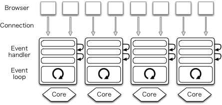
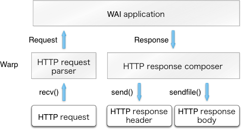
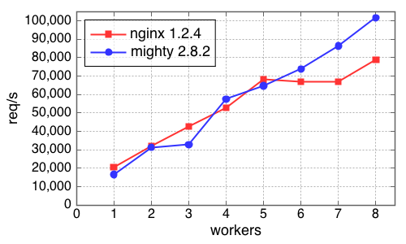

# Warp

Authors: Michael Snoyman and Kazu Yamamoto

Warp is a high-performance HTTP engine library in Haskell,
a purely functional programming language.
Both Yesod, a web application framework, and Mighttpd, an HTTP server,
are implemented over Warp.
According to our throughput benchmark,
Mighttpd provides performance on par with nginx.
This article will explain
the architecture of Warp and how we improved its performance.

## Network programming in Haskell

Some people may still misunderstand that 
functional programming languages are slow or impractical.
However, to our best knowledge, 
Haskell provides the best scheme for network programming.
This is because that GHC (Glasgow Haskell Compiler), 
the flagship compiler of Haskell, provides
light-weight and robust user thread (or sometime called green thread).
In this section, we will briefly explain history of
network programming in server side.

### Native threads

Traditional servers use a technique called thread programming.
In this architecture, each connection is handled
by a single process or native thread.

This architecture can be broken down by how to create processes or native threads.
When using a thread pool, multiple processes or native threads are created in advance.
An example of this is the prefork mode in Apache.
Otherwise, a process or native thread is spawn each time a connection is received. Fig XXX illustrates this.

The advantage of this architecture is that clear code can be written
because the code is not decided into event handlers.
Also, because the kernel assigns processes or
native threads to available cores,
we can balance utilization of cores.
Its disadvantage is a large number of
context switches between kernel and processes or native threads occur.
So, performance gets poor.

### Event driven

Recently, it is said that event-driven programming is 
required to implement high performance servers.
In this architecture multiple connections are handled by a single process (Fix XXX).
Lighttpd is an example of web server using this architecture.

Since there is no need to switch processes,
less context switches occur, and performance is improved.
This is its chief advantage.
However, it has two shortcomings.
The first is the fact that only one core
can be utilized because there is only a single process.
The second is that it requires asynchronous programming,
so code is fragmented into event handlers.
Asynchronous programming also prevents the conventional
use of exception handling (although there are no exceptions in C).

### 1 process per core 

Many have hit upon the idea of creating
N event-driven processes to utilize multi-core processors
where N is the number of cores.
Port 80 must be shared for web servers.
Using the prefork technique (please don't confuse with Apache's prefork mode),
port sharing can be achieved by modifying code slightly.
We call this "1 process per core" (Fig XXX).

One web server that uses this architecture is nginx.
Node.js used the event-driven architecture in the past but
it also implemented 1 process per core recently.

The advantage of this architecture is
that it utilizes all cores of a multi-core processer
and improves performance. 
However, it does not resolve the issue of programs having poor clarity.

### User threads

GHC's user threads can be used to solve the code clarity.
They are implemented over an event-driven IO manager.
GHC's user threads are light weight: 
modern computers can run 100,000 user threads smoothly.
They are robust: even asynchronous exceptions are catch
(we explain this later in detail).

Some languages and libraries provided user-space threads in the past,
but they are not commonly used now because they are not lightweight
or are not robust.
But in Haskell, most computation is non-destructive.
This means that almost all functions are thread-safe.
GHC uses data allocation as a safe point of context switch of user threads.
Because of functional programming style,
new data are often created and it is known that 
[such data allocation is regulaly enough for context switching](http://www.aosabook.org/en/ghc.html).

Use of lightweight threads makes
it possible to write code with good clarity
like traditional thread programming
while keeping high performance (Fig XXX).

## Warp's architecture

Warp is an HTTP engine for WAI (Web Application Interface).
It runs WAI applications over HTTP.
As we described before both Yesod and Mighttpd are
examples of WAI applications as illustrated in Fix XXX.

The type of WAI applications is as follows:

    type Application = Request -> ResourceT IO Response

In Haskell, argument types of function are separated by right arrows and
the most right one is the type of return value.
So, we can interpret the definition
as an application takes `Request` and returns `Response`.

Warp first receives an HTTP request from a client
and parses it to `Request`.
Then, Warp gives the `Request` to an application and
takes a `Response` from it.
Finally, Warp builds an HTTP response based on `Response`
and sends it back to the client.
This is illustrated in Fix XXX.

## Performance of Warp

Before we explain how to improve the performance of Warp,
we would like to show the results of our benchmark.
We measured throughput of Mighttpd 2.8.2 and nginx 1.2.4.
Our benchmark environment is as follows:

- One "12 cores" machine (Intel Xeon E5645, two sockets, 6 cores per 1 CPU, two QPI between two CPUs)
- Linux version 3.2.0 (Ubuntu 12.04 LTS), which is running directly on the machine (i.e. without a hypervisor)

We tested several benchmark tools in the past and
our favorite one is `weighttp`. 
It is based on the `epoll` system call family and can use
multiple native threads. 
We used `weighttp` as follows:

    weighttp -n 100000 -c 1000 -t 3 -k http://127.0.0.1:8000/

This means that 1,000 HTTP connections are established and each connection sends 100 requests. 3 native threads are spawn to carry out these jobs..

For all requests, the same `index.html` file is returned. I used `nginx`'s `index.html` whose size is 151 bytes. As "127.0.0.1" suggests, I measured web servers locally. I should have measured from a remote machine but I don't have suitable environment at this moment.

Since Linux has many control parameters, we need to configure the parameters carefully. You can find a good introduction about Linux parameter tuning in [ApacheBench & HTTPerf](http://gwan.com/en_apachebench_httperf.html).

We carefully configured both Mighty and `nginx` as follows:

- using file descriptor cache
- no logging
- no rate limitation

Since our machine has 12 cores and `weighttp` uses three native threads, we measured web servers from one worker to eight workers(to our experience, three native thread is enough to measure 8 workers). Here is the result:

X-axis is the number of workers and y-axis means throughput whose unit is requests per second. "mighty 2.8.2" (blue) increases workers using the prefork technique. 

## Lesson learned

1. Issuing as few system calls as possible
2. Specialization and avoiding re-calculation
3. Avoiding locks

## HTTP request parser

- Parser generator vs handmade parser
- From "Warp: A Haskell Web Server"?
- Conduit

## HTTP response builder

### response header

- Blaze builder vs low level memory operations

### response body

- Three types
- Blaze builder
- Conduit
- sendfile

### sending header and body together

- http://www.yesodweb.com/blog/2012/09/header-body

## Clean-up with timers

### For connections

- Requirements
- System.Timeout.timeout
- MVar vs IORef
- Its algorithm

Need a fig

### For file descriptors

- Requirements
-- no leakage
-- lookup
-- multimap
-- fast pruning
- Red black tree

Need a fig

## Logging

- Handle
- From the Mighty article in Monad.Reader

Need a fig

- date
- avoiding gettimeofday()
- caching the formatted date

## Other tips

- accept4
- char8
- pessimistic read

## Profiling and benchmarking

- GHC profiler
- httperf/weighttp
- strace
- eventlog
- prof
- tcpdump

## Conclusion
